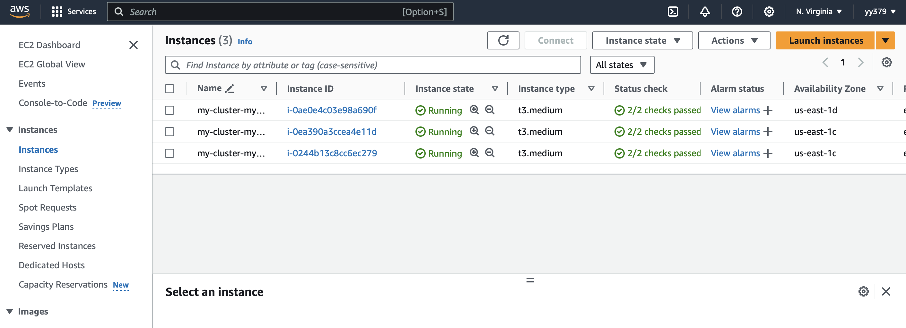

# LLMOps - Model Serving with Rust and Actix Web

- Duke Spring 2024 IDS721 Final Project
- Group Members: Daniel, Emily, Yilin, Hiep
- video demo: https://youtu.be/VpOEaIy_U44

## Description

In this project, we operationalize machine learning by serving an open-source model through a web service developed in Rust. This involves containerizing the service for deployment on Kubernetes and automating the workflow with a CI/CD pipeline. Monitoring, metrics collection, and thorough documentation are essential components of the project, alongside a clear and concise demonstration of the application through a YouTube video.

This project demonstrates the integration of a machine learning model using Rust with Actix Web to serve model predictions over a web service. Specifically, it utilizes the `bloom-560m-15_1-ggjt.bin` model from Rustformers (based on the Huggingface models) to perform text generation tasks. The application is designed to be deployed on AWS Elastic Kubernetes Service (EKS) for scalable and robust operations. Be sure to download the model and put the file in the src folder along with main.rs before running the project.

## Project Features:

1. Obtain Open Source ML Model: We select and acquire an open-source machine learning model suitable for serving. The model is capable of providing inferences based on input data it receives.

2. Create Rust Web Service for Model Inferences: We develop a web service in Rust that can serve the ML model's inferences. The service is robust, efficiently handling requests and providing accurate responses from the model.

3. Containerize Service and Deploy to Kubernetes: We containerize the Rust web service using Docker, ensuring it's well-prepared for deployment. Subsequently, deploy the containerized service to a Kubernetes cluster, configuring it for scalability and reliability.

4. Implement CI/CD Pipeline: We establish a Continuous Integration and Continuous Deployment (CI/CD) pipeline to automate the testing, building, and deployment processes of the application. This pipeline also support rapid iteration and deployment of changes to the service.

## Project Structure

`main.rs`: Sets up the Actix Web server, routes, and CORS configuration. \
`core.rs`: Contains the logic for loading the model, performing inference, and handling errors. \
/src: Contains the model binaries and tokenizer configurations. \
`Cargo.toml`: Manages Rust dependencies and project settings. \
bloom-560m-15_1-ggjt.bin: Rustformer model \

## How to run the Project backend

1. Download the bloom-560m-q5_1-ggjt.bin file from https://huggingface.co/rustformers/bloom-ggml/blob/main/bloom-560m-q5_1-ggjt.bin, and put it under the src directory before running the project.

2. Run backend: go to `artix_backend` folder:

```command
cargo run
```

3. To test the backend locally:

```command
curl -X POST http://127.0.0.1:8080/ -H "Content-Type: application/json" -d '{"message": "Hello, A"}'
```

The result should be a Json, with `response` as key: `{"response":"Hello, Aunt Sally."}% `

## Deploy front end on Docker:

1. Create Docker image:

```
docker build -t rs-model-frontend .
```

2. Deploy front end on Docker:

```
docker run -p 3000:3000 rs-model-frontend
```

Demo deployment of backend and frontend:


## Docker & Kubernetes Deployment

### Docker

1. Build the Docker image

```bash
docker build -t artix-backend .
```

2. Tag the Docker image

```bash
docker tag artix-backend:latest artix-backend:latest
```

3. Run the Docker image locally

```bash
docker run -p 5000:5000 artix-backend:latest
```

4. Push the Docker image to Docker Hub

```bash
docker push artix-backend:latest
```

Link to Docker Image: https://hub.docker.com/r/cr7forever666/artix_backend


### Kubernetes

1. Prepare Your AWS Environment (Install AWS CLI, kubeclt, eksctl, etc.)
2. Create an EKS Cluster

```bash
eksctl create cluster --name my-cluster --region us-west-2 --nodegroup-name my-nodes --node-type t3.medium --nodes 3 --nodes-min 1 --nodes-max 4 --managed
```

3. Configure kubectl to Connect to Your EKS Cluster

```bash
aws eks --region region-code update-kubeconfig --name cluster-name
```

4. Create a Kubernetes Deployment

```yaml
apiVersion: apps/v1
kind: Deployment
metadata:
  name: artix-backend-deployment
spec:
  replicas: 2
  selector:
    matchLabels:
      app: artix-backend
  template:
    metadata:
      labels:
        app: artix-backend
    spec:
      containers:
        - name: artix-backend
          image: yourusername/artix_backend:latest
          ports:
            - containerPort: 8000
```

5. Create a Kubernetes Service

```yaml
apiVersion: v1
kind: Service
metadata:
  name: artix-backend-service
spec:
  type: LoadBalancer
  ports:
    - port: 80
      targetPort: 8000
      protocol: TCP
  selector:
    app: artix-backend
```

6. Apply the Deployment and Service

```bash
kubectl apply -f deployment.yaml
kubectl apply -f service.yaml
```

7. Access the Service

```bash
kubectl get services
```

 8. EC2 Instance
 9. Cluster

